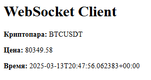
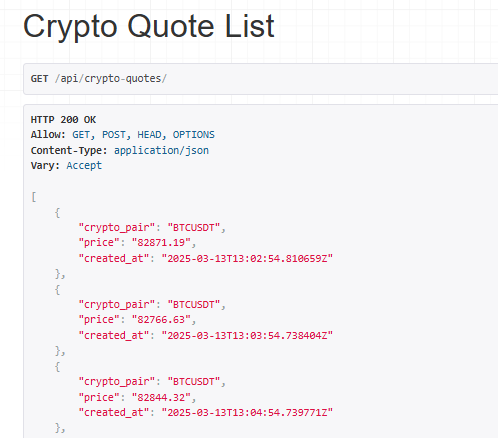

 📈 Django Crypto Tracker

🚀 **Django-приложение для отслеживания криптовалютных котировок** с интеграцией **WebSocket API Binance** и сохранением истории в **PostgreSQL**. Поддерживает **реальное обновление цен** через **Django Channels** и REST API для просмотра истории.

🔥 Функционал

- 📡 **Подключение к WebSocket API Binance** (Tickers Stream)
- 💰 **Получение обновлений цен** по выбранным криптовалютным парам (BTC/USDT, ETH/USDT и др.)
- 🗄 **Сохранение данных в PostgreSQL** (обновления раз в минуту)
- 🌐 **REST API для просмотра истории котировок**
- 🔄 **WebSocket-сервер на Django Channels** для трансляции обновлений клиентам
- ✅ **Юнит-тесты с использованием pytest**

🛠 Используемый стек

- Django + Django Channels (WebSockets)
- PostgreSQL 
- Redis (кеширование)
- pytest + Mock WebSocket 

## ⚙ Установка и запуск

### 1️⃣ Клонирование репозитория

```sh
git clone https://github.com/Kaishivee/django_crypto_tracker.git
cd crypto_quotes
```

### 2️⃣ Установка зависимостей


```sh
python -m venv venv
source venv/bin/activate  # Linux/macOS
venv\Scripts\activate  # Windows
```


```sh
pip install -r requirements.txt
```


### 3️⃣ Запуск миграций базы данных

```sh
python manage.py migrate
```

### 4️⃣ Запуск сервера

```sh
python manage.py runserver
```

Веб-сервер доступен по адресу: [http://127.0.0.1:8000](http://127.0.0.1:8000)


## 🔗 API

### 📌 WebSocket

Подключение к WebSocket-серверу:

```
http://127.0.0.1:8000/api/ws-client/
```

Ответ в реальном времени:

```json
{
    "crypto_pair": "BTCUSDT",
    "price": "80349.58",
    "created_at": "2025-03-13T20:48:56.074083+00:00"
}
```


### 📌 REST API

| Метод | URL | Описание |
|--------|----------------|----------------------------------------|
| GET | `/api/crypto-quotes/` | Получить список котировок |
| GET | `/api/crypto-quotes/?crypto_pair=BTCUSDT` | Фильтр по валютной паре | 
| GET | `/api/crypto-quotes/{id}/` | Получить котировку по ID |



## 🧪 Тестирование

Для запуска тестов используйте:

```sh
pytest
```